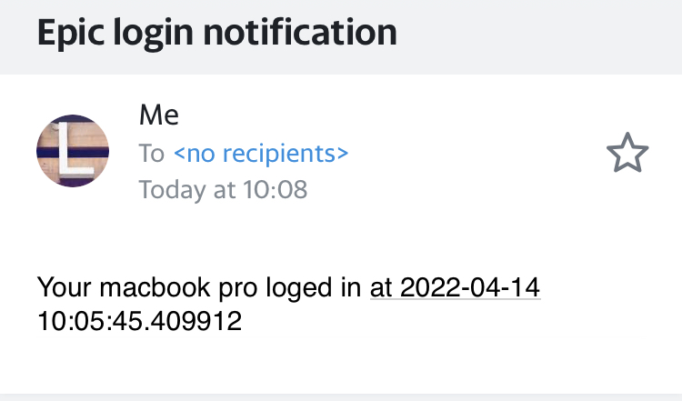

# Email Login Notification
Notifies you when your computer is logged in.

# Aim 

The aim of this project is to learn how to send emails from the command line. This can be tremendously useful for automating large email campaigns and, in this case, sending yourself personalised notifications. Say you want to notify yourself when your computer is logged in, check how your stock portfolio is doing, summarise news from a variety of sources, or tell yourself how cool you are! All these things can be automated and sent to your email inbox whenever you like. This project will focus on sending yourself a login notification.

# Requirements

For this you will need to have:

1. Python3
2. A Yahoo email account
3. Linux or Mac

# Steps

Follow these steps to get started

1. Create a Yahoo email account. 
2. Open the terminal, clone this repo, and cd into it
3. `echo “passwords.py” > .gitignore`
4. In your Yahoo email, goto your Yahoo Account Security page, Click Generate app password
5. `echo “[COPY APP PASSWORD HERE]” > passwords.py`
6. `python3 sendEmail.py`

And there you go, you should receive an email from your terminal in a couple of minutes.

For automating this script every time you login, follow these instructions below they’re great:
https://stackoverflow.com/questions/6442364/running-script-upon-login-mac

# Further notes:

Security best practices suggest holding passwords in the keychain instead of a file like I have done here. For me, preventing public uploads with .gitignore, using a new Yahoo account that can be thrown away, and generating specific app passwords, was enough security for this project. I leave this one up to you. 

You can use gmail accounts and other smtp email accounts but I found Yahoo email was reliable and slightly easier to bypass security than gmail.

# More cool things to try

Take a photo of the person who logged in and attach that to the email.
Detect the person’s face, if it’s you, bypass the above step
https://github.com/ageitgey/face_recognition is an easy way to do face recognition

# Thanks to realpython for making this simple tutorial
https://realpython.com/python-send-email/#option-1-setting-up-a-gmail-account-for-development

